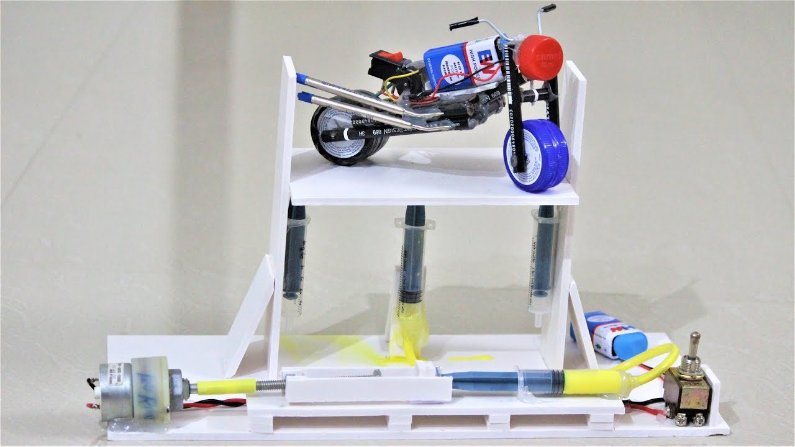
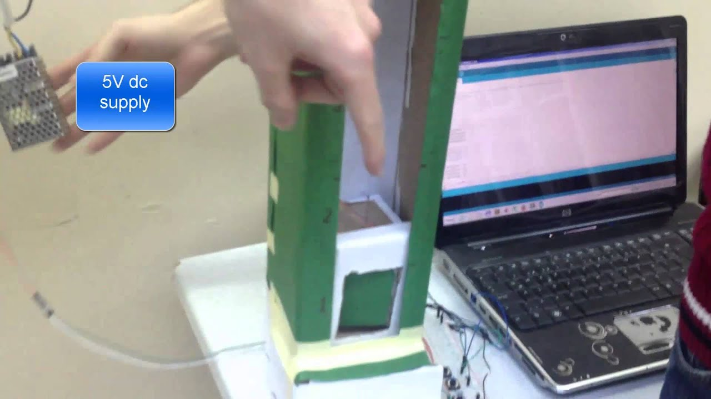
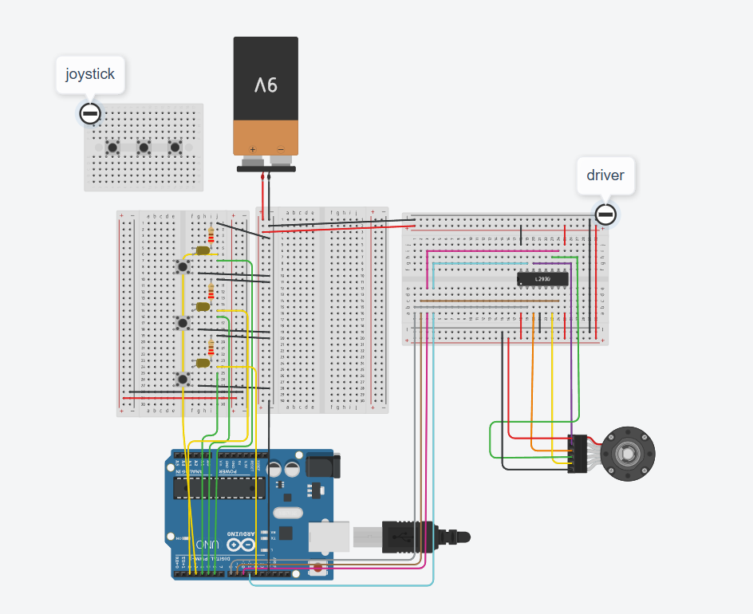

# Elevator

Elevator project with mock-up

# Bedside Elevator

<section align="right">
Made by

<a href="https://github.com/alexandralupulescu">@alexandralupulescu
</a>  
&  
**@siminailie183 (me)**

</section>

## Contents

- Video presentation
- Contributions
- Project objectives
- Field description
- Similar solutions
- Our solution and how it works
  - Materials
  - Other tools
  - The steps to making our project
  - The code
- Testing phase
- Resources we used

## Video presentation

???

## Contributions

We worked together on the project for the most part. We built the mock up together and helped one another. Alexandra did most of the code and I did most of the documentation and the simulation.

## Project Objectives

Trying to fin a project that would fit with our interests, we looked towards the idea of smart houses. We live in the dorms together and we wanted to make something that might make our lives easier. We considered a lot of things form fans to mechanisms that would shut the drapes automatically in the evening, but our favorite was that of the bedside elevator.

The idea: We came up with the elevator in order to solve an issue: that of the person who sleeps in the upper bed of a bunk bed who has to always go "How am I supposed to get in bed with ... object in my hand?" and also the consequence that the person from the bottom bunk has to live with, which comes with the phrase "Could you please give me the ... object?". Thats where the bedside elevator comes up. All one has to do is plase the object they want going up, like a pen or maybe a cup of coffee, in the elevator and press a button (or hold down the joystick) and wait for the object to reach the upper bed.

## Field description

Our focus was on vertical transport. Our primary reference was a building elevator, meant for transporting people. The principle is the same: a motor turns a pulley, which moves a rope up or down, depemding on the situation.

## Similar solutions

Since our lift is a small-scale model, there are differences from real elevators. For example:

- We directly attached the rope to the pulley and the moving platform, because the payload is light. In real elevators, counterweights are used to balance the load.
- We used a stepper motor, which allowed us to simulate a traction motor. A servo motor was considered, but it's not designed for continuous rotation and would’ve required code changes. Stepper motors aren’t ideal for elevators because they can lose steps, affecting positional accuracy over time.
- We also considered hydraulic motors, which use less power (especially when descending), but are harder to implement in a small model.
- Another idea was to use a platform-style lift (like a small table), but the string placement would interfere with the payload's balance.
- We also debated using sensors to detect floor levels. That would have helped solve the step-loss issue by using proximity sensors to detect position. But since this is just a prototype, we skipped that for simplicity.

<section align="center">
</img>
</img>

 Image1. Alternative solutions

</section>

## Our solution and how it works

### Materials

<table>
    <tr>
        <th> Material </th>
        <th> Where we got it </th>
        <th> Price (RON) </th>
    </tr>
    <tr>
        <td>Arduino Uno</td>
        <td> We had it</td>
        <td> Free </td>
    </tr>
    </tr>
    <tr>
        <td>2 Breadboards</td>
        <td>Optimus Digital</td>
        <td>10</td>
    </tr>
    <tr>
        <td>Stepper Motor 28BYJ-48</td>
        <td>Optimus Digital</td>
        <td>17</td>
    </tr>
    <tr>
        <td>Pulley</td>
        <td>Optimus Digital</td>
        <td>10</td>
    </tr>
    <tr>
        <td>Motor Driver</td>
        <td>We had it</td>
        <td>Free</td>
    </tr>
    <tr>
        <td>9V Battery</td>
        <td>Carrefour</td>
        <td>50</td>
    </tr>
    <tr>
        <td>Power Supply Module</td>
        <td>We had it</td>
        <td>Free</td>
    </tr>
    <tr>
        <td>Joystick</td>
        <td>We had it</td>
        <td>Free</td>
    </tr>
    <tr>
        <td>3 Buttons</td>
        <td>We had it</td>
        <td>Free</td>
    </tr>
    <tr>
        <td>3 LEDs</td>
        <td>We had it</td>
        <td>Free</td>
    </tr>
    <tr>
        <td>Resistors</td>
        <td>We had it</td>
        <td>Free</td>
    </tr>
    <tr>
        <td>Jumper Wires</td>
        <td>We had it</td>
        <td>Free</td>
    </tr>
    <tr>
        <td>Wooden Board</td>
        <td>Brico</td>
        <td>35</td>
    </tr>
    <tr>
        <td>Cardboard Box</td>
        <td>We had it</td>
        <td>Free</td>
    </tr>
    <tr>
        <td>Screws</td>
        <td>We had it</td>
        <td>Free</td>
    </tr>
    <tr>
        <td>String</td>
        <td>Carrefour</td>
        <td>10</td>
    </tr>
</table>

### Other tools:

- Scissors
- Cutter
- Tape
- Black spray paint
- Silicone gun
- Screwdriver

### The steps to making our project

- We first started with a simple task: testing the motor to see if it works. We connected it through the driver to the Arduino and powered it with the 9V battery. We used a basic code just to check the functionality (Image 2).

<section align="center">

Image 2. Testing the motor

</section>

- After the test we introduced the buttons. We fixed them on the breadboard and did the coding, so that the elevator would move to each floor (Image 3). For testing we used a box to represent the load and tied the whole thing to the side of a desk. We used the resistance from the arduino for the buttons, which would have normally used a resistor each.

<section align="center">

Image 3. Implementing buttons

</section>

- Our next step was setting up the joystick for the free up and down movement and also the reset function. We also added LED lights to signal the current floor. The buttons, joystick, LEDs and motor each have their addresses in the Arduino and are controlled through the code.

<section align="center">

Image 4. Building the shaft

</section>

- Before building the shaft, we reorganised the components, dividing them onto the two breadboards as follows:
  - One of the breadboards is used for control and has the buttons and LEDs
  - THe other is used to connect everything to the Arduino
- The shaft was made from a wooden board, cut to size. We fixed the motor and pulley to it and added a rope which holds the load, or box in our case, in which we can place the items.

<section align="center">

Image 5. Cable manangement and final testing

</section>

### The code

<a href="ElevatorFinalCode.ino">Here you can download the code for yourself</a>

We used the Arduino IDE for

How it works: First the elevator is considered to be at floor 0, and it's corespondig LED is on. If one of the other 2 buttons is pressed, the function "goToEtaj()" is called. What the function does is:

- It calculates the number of steps between the current floor and the wanted floor;
- We set the difference at 5000 steps betweeen each floor;
- Next the motor is started. It's steps are added for going up and substracted for going down;
- Last step is turning off the LED for the initial floor and turning on the LED for the new current floor.

If the button of the current floor is pressed, the LED turns off and on. Also, the joystick has it's own functionality added. If you tilt it up/down the motor moves up/down as long as you hold it (minimum is 10 steps). This number of steps it moves is counted by a variable "nrRotatii". We did that so that when you press on the joystick it goes back to the floor it was previously set to moving a "-nrRotatii" number of steps.

## Testing phase

### Simulation:

<section align="center">

Image 6. Tinkercad simulation

</section>

The simulation of the project was made in Tinkercad (Image 6.). It unfortunately doesn't have the functionalities of our project since Tinkercad did not have most of the components, so it's just a schematic. The joystick is represented by the mini-breadboard with 3 buttons (one for each functionality of the joystick) and the motor driver is the breadboard with the h-bridge on it.

### Issues we came across

- Power supply issues: At first we couldn't power the motor at all, and after a couple of changes it would only vibrate but not turn the pulley. After we added the power supply module it started to work properly.
- Uncalibrated joystick: We had an issue where the joystick was not calibrated to the middle of the interval (0, 1023)
- The shaft size: it was pretty tough finding wooden boards the right size for our build and at a reasonable price so we ended up buying a larger board and cutting it.
- Too few pins: our initial plan was to signal the current floor using a display nut we didn't have enough pins left on the Arduino, so we came up with the idea of using thr 3 LEDs for that same purpose.

## Resources we used

1. <a href="https://www.youtube.com/watch?v=N2rmLqeR1Lw">How to connect a step motor </a>
2. <a href="https://www.instructables.com/Arduino-Controlled-Model-Elevator/">Elevator inspo 1</a>
3. <a href="https://ulasdikme.com/2014/05/20/arduino-simple-elevator/">Elevator inspo 2</a>
4. <a href="https://www.youtube.com/watch?v=TQwB0U-LHb8">Elevator inspo 3</a>
5. <a href="https://isfelevator.com/what-type-of-elevator-motor-is-best-fit-to-your-need/">Types of elevator motors</a>
